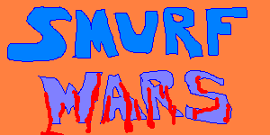

# Smurf Wars
 
This is an old game I wrote when I was starting out as a developer. It was written using Visual Basic 5 and leverages the Windows API for graphics. It's pretty crude, but I was just starting out.

In the game, the player uses the mouse to aim at Smurfs who are charging across a battefield. Clicking on a Smurf shoots it. The player must also dodge incoming fire from the (heavily armed) smurfs.

It's definitely not the best thing I've done, but I've uploaded it here for posterity.
